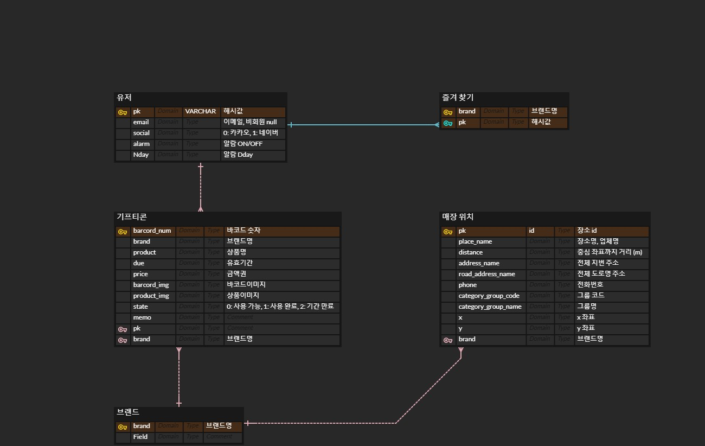

# 오늘 한 일

## 팀
- 컨설턴트님과의 상담 후 기능 명세서 세부사항 구체화
- UI 구조 확정 후 Figma 작성 시작 
- DB erd 작성
- 백엔드 회의에서 구현할 REST API 목록과 사용할 API 정리

## 개인
- 소셜 로그인 참고 자료 확보
- 사용할 수 있는 API 조사 및 공유
- 경쟁사 어플을 참고하여 사용자 관점에서 의견내기
- DB 작성 및 백엔드 회의 참여

## ERD

